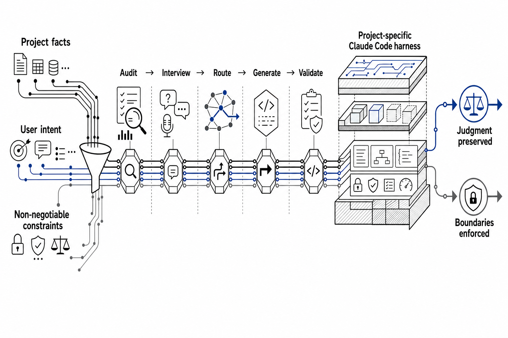

<div align="center">

# Harness Creator

**The interview-driven harness creator for Claude Code.**

Preserve Claude’s judgment. Enforce only what must not fail.

[](https://github.com/tjdwls101010/Harness-Creator/releases/latest)
[](LICENSE)
[](https://claude.com/claude-code)
[](https://www.python.org/)
[](https://github.com/tjdwls101010/Harness-Creator/actions/workflows/ci.yml)

[In 60 seconds](#1-harness-creator-in-60-seconds) · [Install](#2-install) · [Compare](#3-choose-your-approach) · [Layers](#4-seven-possible-layers) · [Docs](#8-documentation)


Canonical repository: **[github.com/tjdwls101010/Harness-Creator](https://github.com/tjdwls101010/Harness-Creator)**

</div>

## 1. Harness Creator in 60 seconds

Claude Code can already reason about a project. The hard part is deciding which project facts should always be present, which procedures should load only when needed, and which boundaries must be enforced by code rather than remembered from prose.

Harness Creator handles that design work through a structured interview. It audits the repository, turns your intent into explicit needs, routes each need to the right Claude Code layer, generates the approved files, and validates their structure.

Think of this as a design heuristic, not a literal definition:

> **`ai-agent = ai-model + ai-harness`**

The model supplies general capability. The harness supplies project-specific context, procedures, tools, permissions, and verification.



*Harness Creator turns project facts, user intent, and hard constraints into adaptable behavior inside verified boundaries.*

The result is not a generic bundle of files. It is a recorded answer to two questions:

- Where should each identified need live?
- What evidence will show that the resulting harness is structurally sound?

## 2. Install

### 2.1. Claude Code plugin — recommended

Requirements:

- [Claude Code](https://claude.com/claude-code)
- Python 3.10 or later for the bundled standard-library scripts
- Git

Add this repository as a Claude Code marketplace:

```bash
claude plugin marketplace add tjdwls101010/Harness-Creator
```

Install the plugin:

```bash
claude plugin install harness-creator@harness-creator
```

From the project that needs a harness, invoke:

```text
/harness-creator:harness-creator
```

You can also describe the goal naturally:

```text
Set up a Claude Code harness for this project.
```

### 2.2. Skills CLI — secondary

Install only the skill for Claude Code with the skills CLI:

```bash
npx skills add tjdwls101010/Harness-Creator --agent claude-code --skill harness-creator
```

Invoke the installed skill as `/harness-creator` in a fresh Claude Code session.

> [!WARNING]
> Keep exactly one installation active. The Claude Code plugin, skills CLI installation, and development symlink must not be active at the same time; otherwise the same skill can be registered more than once under different names.

### 2.3. Development symlink

Contributors who are editing this repository can link the source directory directly:

```bash
ln -s "$(pwd)/.claude/skills/harness-creator" ~/.claude/skills/harness-creator
```

Use the symlink only for development. Remove or disable plugin and skills CLI installations first.

### 2.4. First run

Harness Creator begins with a read-only audit. It identifies the current harness state and suggests one of four re-entry modes:

- `new` for a project without a harness;
- `extend` for adding a new behavior;
- `improve` for fixing an existing behavior;
- `sync` for reconciling what a past pass decided with the files on disk.

The interview then asks only for decisions the repository cannot answer on its own. Before generation, you approve the resulting design.

Follow the full guided path in [Create your first harness](docs/wiki/tutorials/first-harness.md).

## 3. Choose your approach

Harness Creator is one way to build a Claude Code harness. The right choice depends on how much discovery, routing, and maintenance support you need.

| Approach | Project discovery | Layer decisions | Generation | Validation | Best fit |
|---|---|---|---|---|---|
| Manual configuration | You inspect everything | You make every decision | You write each file | You design the checks | Experts who want direct control |
| Static template | Minimal | Mostly predetermined | Copy and edit | Usually manual | Similar projects with known conventions |
| Component collection | Partial | You assemble the pieces | Reuse selected parts | Varies by component | Teams with an established internal system |
| Harness Creator | Repository audit plus interview | Each need is routed deliberately | Approved project-specific components | Structural checks plus evidence for the approved behavior | Claude Code users who want a guided, inspectable process |

Harness Creator does not remove judgment from the user or the model. It makes routing decisions explicit and records why each generated layer exists.

## 4. Seven possible layers

A harness can use any subset of seven layers:

| Layer | Deliberate home for |
|---|---|
| `CLAUDE.md` | Project facts and conventions relevant to most sessions |
| `.claude/rules/*.md` | Constraints scoped to particular paths or concerns |
| `.claude/skills/` | Reusable procedures and domain knowledge loaded on demand |
| Hooks and permissions | Deterministic checks, blocks, and tool boundaries |
| `.claude/agents/*.md` | Context-isolated roles for focused work |
| `.claude/workflows/*.js` | Repeatable orchestration with a fixed execution shape |

> **Complete does not mean every layer. It means every identified need has a deliberate home, and no layer is generated without a reason.**

A small project may need only `CLAUDE.md` and a skill. A hard security boundary may justify a hook or permission rule. A workflow or subagent is generated only when the interview identifies a case that benefits from it.

See the [Harness reference](docs/wiki/reference/harness.md) for the exact responsibilities and tradeoffs of each layer.

## 5. How it works

The operating loop is:

1. **Audit** — inspect existing Claude Code files and the commits that changed them.
2. **Interview** — establish goals, inventory needs, resolve component details, and define validation evidence.
3. **Route** — assign each approved need to a layer whose authority and loading behavior fit it.
4. **Generate** — create only the approved components.
5. **Validate** — check structure and gather the behavioral evidence agreed in the design.

The design and its success criteria are settled before generation. Existing approval remains valid where its inputs still hold; a repair revisits the decisions its evidence changes.

Files show what exists; they never show why a need was routed to one layer instead of another. That goes in the commit and pull request the pass hands off, which is also where the next pass looks for it.

Read [Interview and re-entry reference](docs/wiki/reference/interview-and-reentry.md) for the state model and [Layer routing](docs/wiki/explanation/layer-routing.md) for the decision framework.

## 6. Validation

Harness Creator separates two kinds of evidence.

### 6.1. Structural validation

Structural validation is deterministic and runs locally:

```bash
python3 .claude/skills/harness-creator/scripts/validate_harness.py --path .
```

It checks harness shape: frontmatter, paths, references, hooks, permissions, rules, agents, workflows, imports, and the always-loaded instruction budget. A clean result means the files satisfy those structural contracts.

It does **not** prove that Claude will behave correctly in every task.

### 6.2. Hook testing

Generated command hooks can be exercised without a live session:

```bash
python3 .claude/skills/harness-creator/scripts/test_hook.py \
  --settings .claude/settings.json \
  --event PreToolUse \
  --tool Bash
```

The tool reproduces matcher evaluation, runs the selected hook with realistic input, and explains the effect of its exit code and output channel.

### 6.3. Behavioral end-to-end validation

When a structural check cannot establish the approved behavior, `run_e2e.py` launches a real headless Claude Code session and records a transcript for grading. Scenarios that write run against an isolated project copy.

Scenario coverage follows the behaviors and failure modes under test, using the model the harness will serve. Structural validity, observed behavior and interactive interview quality are separate claims; see the [E2E authoring guide](.claude/skills/harness-creator/references/e2e-testing.md) for their evidence boundaries.

## 7. Philosophy

Harness Creator follows a simple division of responsibility:

- Give the model principles and project context for cases that cannot be enumerated.
- Use hooks, permissions, and tests for behavior that must block or be verified.
- Load detailed procedures only when the task needs them.
- Delete redundant instructions when evaluation shows they add no value.

This preserves room for case-specific judgment without confusing advisory prose with enforcement.


*Principles guide adaptation; deterministic controls enforce the boundaries that cannot be left to interpretation.*

<p align="center">
  <a href="https://www.youtube.com/watch?v=qyPCVqFUyDo&amp;t=740s">
    
  </a><br />
  <sub><a href="https://www.youtube.com/watch?v=qyPCVqFUyDo&amp;t=740s">Watch Boris Cherny discuss the empirical removal of redundant prompt constraints (starts at 12:20).</a></sub>
</p>

Read [Design principles](docs/wiki/explanation/design-principles.md) for the full argument and annotated primary sources.

## 8. Documentation

The canonical documentation lives in [`docs/wiki/`](docs/wiki/README.md) and is organized by reader need.

| Need | Start here |
|---|---|
| Learn by building | [Create your first harness](docs/wiki/tutorials/first-harness.md) |
| Improve an existing setup | [Improve an existing harness](docs/wiki/tutorials/improve-an-existing-harness.md) |
| Complete a specific task | [How-to guides](docs/wiki/README.md#how-to-guides) |
| Look up exact behavior | [Reference](docs/wiki/README.md#reference) |
| Understand the design | [Explanation](docs/wiki/README.md#explanation) |

High-use pages:

- [Install and update](docs/wiki/how-to/install-and-update.md)
- [Maintain an existing harness](docs/wiki/how-to/maintain-a-harness.md)
- [Validate a harness](docs/wiki/how-to/validate-a-harness.md)
- [Troubleshooting](docs/wiki/how-to/troubleshooting.md)
- [CLI reference](docs/wiki/reference/cli.md)
- [Harness reference](docs/wiki/reference/harness.md)
- [Support, compatibility, and FAQ](docs/wiki/reference/support-and-faq.md)
- [Architecture](docs/wiki/explanation/architecture.md)
- [Design principles](docs/wiki/explanation/design-principles.md)

## 9. Contributing and support

Contributions are welcome. Start with [CONTRIBUTING.md](CONTRIBUTING.md) for the development setup, documentation conventions, and required checks.

Use [SUPPORT.md](SUPPORT.md) to choose the right route for a question, bug, feature request, documentation problem, or security report. General support is best effort and has no response-time guarantee.

Please follow the [Code of Conduct](CODE_OF_CONDUCT.md) in all project spaces.

## 10. Security

Do not report vulnerabilities in a public issue. Follow [SECURITY.md](SECURITY.md) and use GitHub private vulnerability reporting.

Only the latest tagged release receives best-effort security support. No response or fix SLA is promised.

## 11. License

Harness Creator is available under the [MIT License](LICENSE).
