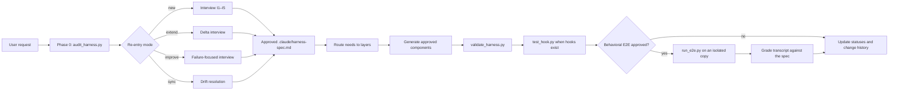

# Architecture

This explanation maps the exact Harness Creator flow, packaged files, and validation boundaries for contributors and advanced users.

## 1. End-to-end flow

The spec approval node is the generation gate. Structural validation runs after generation. Hook testing is conditional on generated hooks, and behavioral E2E is optional and consent-gated.

## 2. Repository map

| Path | Responsibility |
|---|---|
| `.claude-plugin/plugin.json` | Plugin identity, version, description, author, distribution metadata, and skill path |
| `.claude-plugin/marketplace.json` | Single-plugin personal marketplace catalog |
| `.claude/skills/harness-creator/SKILL.md` | Always-loaded orchestration and routing doctrine |
| `.claude/skills/harness-creator/references/` | On-demand component and interview guidance |
| `.claude/skills/harness-creator/scripts/` | Parameterized audit, validation, hook, event, and E2E tools |
| `.claude/harness-spec.md` | This repository's own dogfooded harness record |
| `tests/` | Standard-library unit tests and fixture harnesses |
| `docs/wiki/` | Canonical user and contributor documentation |
| `docs/plan/` | Design, research, and implementation records |

## 3. Dual-purpose skill directory

`.claude/skills/harness-creator/` is both this repository's project skill and the plugin's shipped skill component. `.claude-plugin/plugin.json` points `skills` at `./.claude/skills` so the same source is used in both contexts.

There is no duplicate root-level `skills/` copy. This avoids source drift and lets the repository dogfood the shape it generates for other projects.

## 4. Progressive loading

`SKILL.md` contains the operating loop and decisions needed on every invocation. Phase 0 chooses the mode; the interview reference loads at Phase 1, covering all four modes in one file. Component references load only when generation reaches that layer. Python scripts execute as processes and do not need to enter model context.

The split follows execution branches rather than file size.

## 5. Shared script logic

`harness_common.py` centralizes conservative frontmatter parsing, component discovery, known tools and hook events, matcher classification, and spec helpers. User-facing scripts import it so audit and validation agree on the same filesystem semantics.

`hook_event.py` places a query interface in front of the full hook-event reference. The source remains reviewable Markdown while a task can load only one event's contract.

## 6. Validation layers

| Layer | Tool | Evidence |
|---|---|---|
| Structural | `validate_harness.py` | Known file and cross-file contracts |
| Hook behavior | `test_hook.py` | Matching, execution, exit, and output for selected inputs |
| Session behavior | `run_e2e.py` plus separate grading | Transcript evidence for an approved scenario |

The layers are cumulative, not interchangeable.

## 7. Packaging and installation

The personal marketplace points to the repository root. Claude Code copies plugin content into its cache, so source edits require an update and reload. The development symlink bypasses that cache and must not be active alongside the plugin or skills CLI install.

## 8. Next

Read [Design principles](design-principles.md#4-progressive-disclosure) for the context design or [CLI reference](../reference/cli.md) for the executable surface. Return to the [documentation index](../README.md).
