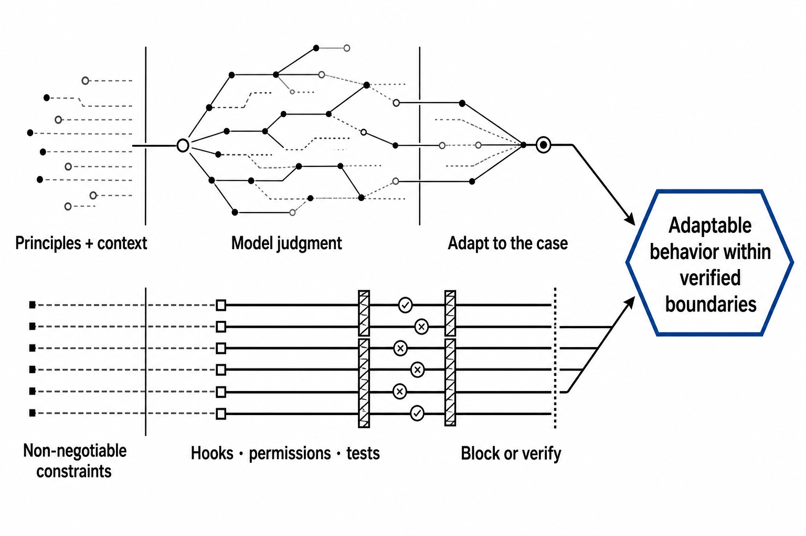

# Design principles

This explanation connects the harness mental model, progressive disclosure, model judgment, and deterministic controls for readers evaluating the project's design.

## 1. Why a harness exists

A model can reason about code without knowing which command this repository uses for tests, which directories are generated, which migrations are append-only, or which release steps the team has agreed to follow.

Those facts and constraints are neither model weights nor one-off user prompts. They belong to the environment surrounding the model: the harness.

The heuristic `ai-agent = ai-model + ai-harness` makes that division visible. It is not a literal definition of every agent system. It is a reminder that project outcomes depend on general capability plus the context, procedures, tools, and controls supplied around it.

## 2. Judgment and verified boundaries

Some project decisions cannot be exhaustively enumerated. “Write code that fits the surrounding module” requires judgment about naming, abstraction, and local style.

Other requirements have a crisp unacceptable state. “Never edit an applied migration” can be checked before the action and blocked. Treating both as prose weakens the second; treating both as rigid code makes the first brittle.

*Adaptable behavior combines case-sensitive judgment with controls that verify or block boundaries the project cannot leave to interpretation.*

Principles, goals, examples, and project facts help the model infer the right action in a new case. Hooks, permissions, scripts, schemas, and tests are appropriate when the project needs a repeatable decision independent of conversational context.

Deterministic does not mean automatically correct. Enforcement still needs representative allowed, denied, boundary, and failure inputs.

## 3. A harness is a system of surfaces

Claude Code surfaces carry different load timing, authority, and cost:

- `CLAUDE.md` keeps high-frequency project context present;
- rules can narrow guidance by path;
- skills load reusable procedures on demand;
- hooks and permissions add deterministic control;
- agents isolate context and tool policy;
- workflows encode repeatable orchestration;
- the harness spec records intent and lifecycle.

A good harness is not the largest collection of these files. It is the smallest set that gives every identified need enough context and authority.

Consider “database migrations are append-only.” A root instruction advises in every session, a path-scoped rule presents the constraint near migration work, and a hook can reject an edit. The right destination depends on whether exceptions exist, how costly a violation is, and whether another control already catches it.

## 4. Progressive disclosure

Always-loaded context competes with the user's task, repository evidence, tool results, and conversation history. Guidance useful during hook authoring can be noise during a documentation task.

Progressive disclosure keeps a discoverable route present while loading detail only at the branch where it becomes useful:

| Surface | Load point |
|---|---|
| `SKILL.md` | Every Harness Creator invocation |
| Interview reference | Phase 1, after Phase 0 chooses a mode |
| Component reference | When routing reaches that component |
| Hook event row | When an event is selected |
| Python implementation | Executed as a subprocess, not loaded as prose |

File length alone is not a reason to split. Deferred content still needs an accurate pointer and a reliable load condition. Otherwise the design has hidden required context rather than disclosed it progressively.

Common failure modes are over-splitting, duplicate authority, hidden prerequisites, stale pointers, and an always-loaded index that becomes the documentation it was meant to defer.

## 5. Persist rationale and evidence

Configuration files show what exists but rarely preserve rejected alternatives or the user's reason for a decision. `.claude/harness-spec.md` keeps the behavior inventory, routing, rationale, status, validation evidence, and change history.

Structural validation can establish known schemas, paths, references, and selected cross-file contracts. Hook tests exercise selected deterministic inputs. A behavioral E2E scenario provides evidence for one real interaction. No single check proves universal behavior.

## 6. Delete redundant rules empirically

Anthropic reported removing more than 80% of the Claude Code system prompt for newer models with no measurable loss on its coding evaluations. The supported lesson is to identify overlapping constraints, remove them, and evaluate the result while retaining useful product context, interfaces, references, and deterministic controls.

It does not support applying the same percentage to another harness, deleting constraints without evaluation, or claiming an 80% performance improvement.

## 7. Annotated primary sources

- [The new rules of context engineering for Claude 5 generation models](https://claude.com/blog/the-new-rules-of-context-engineering-for-claude-5-generation-models) — Anthropic's account of overconstraint, empirical prompt reduction, progressive disclosure, and interface design.
- [Steering Claude Code: when to use CLAUDE.md, skills, hooks, and subagents](https://claude.com/blog/steering-claude-code-skills-hooks-rules-subagents-and-more) — product-level differences in load timing, compaction, context cost, and authority; it recommends hooks or permissions for real guardrails.
- [Claude's Constitution](https://www.anthropic.com/constitution) — primary context for principle-guided judgment, operator intent, and cases not explicitly covered by instructions.
- [Amanda Askell interview](https://podcast.newcomer.co/episode/amanda-askell-on-ai-consciousness-claude-amp-silicon-valleys-biggest-fear) — relevant only for the engineering observation that novel situations require judgment and judgment-heavy evaluation is difficult. It is not evidence for consciousness claims or performance gains from treatment.

## 8. Supports and does not support

| The sources support | The sources do not support |
|---|---|
| Give principles and context for cases that cannot be enumerated | Claude will always infer the intended action |
| Use deterministic controls for non-negotiable boundaries | Every important instruction must become a hook |
| Load narrow detail only when relevant | Shorter context is automatically better |
| Remove redundant constraints and evaluate the result | A universal 80% reduction or improvement claim |
| Preserve useful product context, references, evaluations, and controls | Claims about consciousness, emotions, or model welfare |

## 9. Practical synthesis

1. State the project purpose and success criteria.
2. Give the model the facts needed to adapt to the case.
3. Identify states the project cannot accept.
4. Enforce or verify those states with the narrowest deterministic control.
5. Test the control and evaluate whether surrounding prose remains necessary.
6. Record the principle, boundary, and evidence in the harness spec.

## 10. Next

Apply these principles with [Layer routing](layer-routing.md), inspect the implementation in [Architecture](architecture.md), or look up the concrete layers in [Harness reference](../reference/harness.md). Return to the [documentation index](../README.md).
